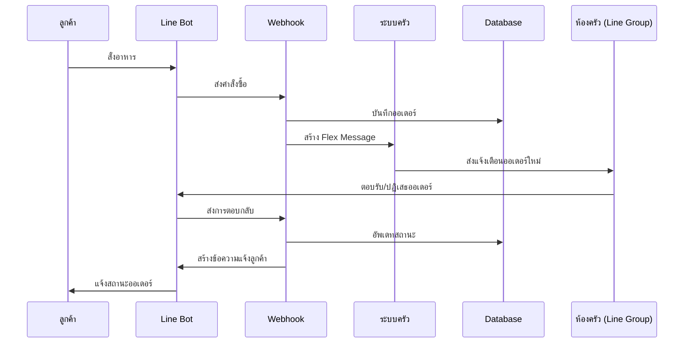

# คู่มือการพัฒนาระบบรับออเดอร์ผ่านรูปภาพ

## แบ่งตามลำดับการทำงาน (Sequence Diagram)

### Part 1: การรับรูปภาพจาก Line

**Sequence: S->>L: ถ่ายและอัพโหลดรูปออเดอร์ → L->>W: ส่งข้อความรูปภาพ**

```javascript
// 1. สร้าง Webhook Handler
const { app } = require("@azure/functions");
const { getImageContent } = require("../services/line.service");

app.http("lineWebhook", {
    methods: ["POST"],
    handler: async (request, context) => {
        const event = JSON.parse(request.body).events[0];

        // ตรวจสอบว่าเป็นข้อความรูปภาพ
        if (event.message?.type === "image") {
            try {
                // ดึงข้อมูลรูปภาพจาก Line
                const imageBuffer = await getImageContent(event.message.id);
                // ส่งต่อไปประมวลผล...
            } catch (error) {
                context.error("Error getting image:", error);
            }
        }
    },
});

// 2. สร้าง Line Service
const getImageContent = async (messageId) => {
    const response = await axios.get(`https://api-data.line.me/v2/bot/message/${messageId}/content`, {
        headers: { Authorization: `Bearer ${process.env.LINE_CHANNEL_TOKEN}` },
        responseType: "arraybuffer",
    });
    return Buffer.from(response.data);
};
```

### Part 2: การประมวลผลรูปภาพ

**Sequence: W->>I: ประมวลผลรูปภาพ → I->>FR: วิเคราะห์เนื้อหาในรูป**

```javascript
// 1. ตั้งค่า Form Recognizer Client
const { DocumentAnalysisClient } = require("@azure/ai-form-recognizer");

const formRecognizerService = {
    client: new DocumentAnalysisClient(process.env.FORM_RECOGNIZER_ENDPOINT, process.env.FORM_RECOGNIZER_KEY),

    async analyzeImage(imageBuffer) {
        try {
            const poller = await this.client.beginAnalyzeDocument("prebuilt-document", imageBuffer);
            const { content, tables } = await poller.pollUntilDone();
            return this.extractOrderItems(tables);
        } catch (error) {
            throw new Error("Form recognition failed: " + error.message);
        }
    },

    extractOrderItems(tables) {
        const items = [];
        for (const table of tables) {
            for (let i = 1; i < table.rowCount; i++) {
                // ข้ามส่วนหัว
                const row = table.cells.filter((cell) => cell.rowIndex === i);
                items.push({
                    name: row.find((cell) => cell.columnIndex === 0)?.content,
                    quantity: parseInt(row.find((cell) => cell.columnIndex === 1)?.content) || 1,
                });
            }
        }
        return items;
    },
};
```

### Part 3: การจับคู่รายการกับเมนู

**Sequence: FR-->>I: ส่งคืนรายการที่อ่านได้ → I->>O: ประมวลผลรายการออเดอร์**

```javascript
// 1. สร้าง Menu Matcher Service
const menuMatcherService = {
    async matchItems(recognizedItems) {
        const matchedItems = [];
        const db = await openDatabase();

        for (const item of recognizedItems) {
            try {
                const menuItem = await this.findMenuItem(db, item.name);
                if (menuItem) {
                    matchedItems.push({
                        menuId: menuItem.id,
                        name: menuItem.name,
                        quantity: item.quantity,
                    });
                }
            } catch (error) {
                console.error(`Error matching item ${item.name}:`, error);
            }
        }

        await closeDatabase(db);
        return matchedItems;
    },

    async findMenuItem(db, itemName) {
        return new Promise((resolve, reject) => {
            db.get(
                `SELECT id, name, price FROM tb_menu 
                 WHERE name LIKE ? 
                 OR ? LIKE CONCAT('%', name, '%')`,
                [`%${itemName}%`, itemName],
                (err, row) => {
                    if (err) reject(err);
                    resolve(row);
                },
            );
        });
    },
};
```

### Part 4: การจัดการตะกร้าและการยืนยัน

**Sequence: O->>DB: เพิ่มรายการในตะกร้า → O->>L: ส่งข้อความยืนยัน**

```javascript
// 1. สร้าง Cart Service
const cartService = {
    async addItemsToCart(userId, items) {
        const db = await openDatabase();

        try {
            for (const item of items) {
                await this.addToCart(db, userId, item.menuId, item.quantity);
            }
            return await this.getCartSummary(db, userId);
        } finally {
            await closeDatabase(db);
        }
    },

    async getCartSummary(db, userId) {
        // ดึงข้อมูลสรุปตะกร้า
        const items = await new Promise((resolve, reject) => {
            db.all(
                `SELECT m.name, c.quantity, m.price
                 FROM tb_cart c
                 JOIN tb_menu m ON c.menu_id = m.id
                 WHERE c.user_id = ?`,
                [userId],
                (err, rows) => {
                    if (err) reject(err);
                    resolve(rows);
                },
            );
        });

        return this.createConfirmationMessage(items);
    },

    createConfirmationMessage(items) {
        return {
            type: "flex",
            altText: "ยืนยันรายการอาหาร",
            contents: {
                type: "bubble",
                body: {
                    type: "box",
                    layout: "vertical",
                    contents: [
                        {
                            type: "text",
                            text: "รายการที่สั่ง",
                            weight: "bold",
                            size: "xl",
                        },
                        ...items.map((item) => ({
                            type: "box",
                            layout: "horizontal",
                            contents: [
                                {
                                    type: "text",
                                    text: item.name,
                                    size: "sm",
                                    flex: 4,
                                },
                                {
                                    type: "text",
                                    text: `${item.quantity}x`,
                                    size: "sm",
                                    flex: 1,
                                },
                            ],
                        })),
                    ],
                },
                footer: {
                    type: "box",
                    layout: "horizontal",
                    contents: [
                        {
                            type: "button",
                            action: {
                                type: "message",
                                label: "ยืนยัน",
                                text: "ยืนยันออเดอร์",
                            },
                            style: "primary",
                        },
                        {
                            type: "button",
                            action: {
                                type: "message",
                                label: "ยกเลิก",
                                text: "ยกเลิกออเดอร์",
                            },
                        },
                    ],
                },
            },
        };
    },
};
```

### Part 5: การส่งออเดอร์ไปยังครัว

**Sequence: L->>O: ประมวลผลการยืนยัน → O->>K: ส่งไปยังครัว**

```javascript
// 1. สร้าง Kitchen Service
const kitchenService = {
    async submitOrder(userId) {
        const db = await openDatabase();
        try {
            // สร้างออเดอร์ใหม่
            const orderId = await this.createOrder(db, userId);
            // ย้ายรายการจากตะกร้าไปออเดอร์
            await this.moveCartToOrder(db, userId, orderId);
            // ส่งการแจ้งเตือนไปยังครัว
            await this.notifyKitchen(orderId);
            return orderId;
        } finally {
            await closeDatabase(db);
        }
    },

    async createOrder(db, userId) {
        return new Promise((resolve, reject) => {
            db.run(
                `INSERT INTO tb_orders (user_id, status, created_at)
                 VALUES (?, 'pending', datetime('now'))`,
                [userId],
                function (err) {
                    if (err) reject(err);
                    resolve(this.lastID);
                },
            );
        });
    },

    async notifyKitchen(orderId) {
        // ส่งข้อมูลไปยังจอแสดงผลในครัว
        // (ในที่นี้เป็นตัวอย่างการใช้ WebSocket)
        if (global.kitchenSocket) {
            global.kitchenSocket.emit("new_order", { orderId });
        }
    },
};
```

### การรวมทุกส่วนเข้าด้วยกัน

```javascript
// Main webhook handler
app.http("lineWebhook", {
    methods: ["POST"],
    handler: async (request, context) => {
        const event = JSON.parse(request.body).events[0];

        try {
            if (event.message?.type === "image") {
                // 1. รับรูปภาพ
                const imageBuffer = await getImageContent(event.message.id);

                // 2. ประมวลผลรูปภาพ
                const recognizedItems = await formRecognizerService.analyzeImage(imageBuffer);

                // 3. จับคู่กับเมนู
                const matchedItems = await menuMatcherService.matchItems(recognizedItems);

                // 4. เพิ่มลงตะกร้าและส่งข้อความยืนยัน
                const confirmationMessage = await cartService.addItemsToCart(event.source.userId, matchedItems);

                // ส่งข้อความยืนยันกลับไปยัง Line
                await replyMessage(event.replyToken, confirmationMessage);
            }

            // จัดการข้อความยืนยัน
            if (event.message?.type === "text" && event.message.text === "ยืนยันออเดอร์") {
                // 5. ส่งออเดอร์ไปยังครัว
                const orderId = await kitchenService.submitOrder(event.source.userId);

                // แจ้งผลการยืนยัน
                await replyMessage(event.replyToken, {
                    type: "text",
                    text: `ออเดอร์ #${orderId} ถูกส่งไปยังครัวแล้ว`,
                });
            }
        } catch (error) {
            context.error("Error processing message:", error);
            // จัดการข้อผิดพลาด
            await replyMessage(event.replyToken, {
                type: "text",
                text: "ขออภัย เกิดข้อผิดพลาดในการประมวลผล กรุณาลองใหม่อีกครั้ง",
            });
        }
    },
});
```

# Part 6: การส่งข้อความแจ้งเตือนห้องครัว

**Sequence: O->>K: ส่งไปยังครัว → K-->>L: อัพเดทสถานะ**

## 1. Kitchen Line Service

```javascript
// kitchen.service.js
const { pushMessage } = require("../services/line_messaging_api.service");

const kitchenService = {
    // Kitchen Group Line ID จะถูกเก็บใน Environment Variable
    KITCHEN_GROUP_ID: process.env.LINE_KITCHEN_GROUP_ID,

    async notifyKitchen(orderId, items) {
        try {
            // สร้าง Flex Message สำหรับครัว
            const kitchenMessage = await this.createKitchenFlexMessage(orderId, items);
            // ส่งข้อความไปยังห้องครัว
            await pushMessage({
                to: this.KITCHEN_GROUP_ID,
                messages: [kitchenMessage],
            });

            return true;
        } catch (error) {
            console.error("Error notifying kitchen:", error);
            throw error;
        }
    },

    createKitchenFlexMessage(orderId, items) {
        return {
            type: "flex",
            altText: `ออเดอร์ใหม่ #${orderId}`,
            contents: {
                type: "bubble",
                header: {
                    type: "box",
                    layout: "vertical",
                    contents: [
                        {
                            type: "text",
                            text: `ออเดอร์ #${orderId}`,
                            weight: "bold",
                            color: "#ffffff",
                            size: "xl",
                        },
                    ],
                    backgroundColor: "#FF4081",
                },
                body: {
                    type: "box",
                    layout: "vertical",
                    contents: [
                        ...items.map((item) => ({
                            type: "box",
                            layout: "horizontal",
                            contents: [
                                {
                                    type: "text",
                                    text: `${item.quantity}x`,
                                    size: "sm",
                                    weight: "bold",
                                    flex: 1,
                                },
                                {
                                    type: "text",
                                    text: item.name,
                                    size: "sm",
                                    flex: 4,
                                },
                                {
                                    type: "text",
                                    text: item.note || "-",
                                    size: "sm",
                                    color: "#888888",
                                    flex: 2,
                                },
                            ],
                            margin: "sm",
                        })),
                    ],
                },
                footer: {
                    type: "box",
                    layout: "horizontal",
                    contents: [
                        {
                            type: "button",
                            action: {
                                type: "message",
                                label: "รับออเดอร์",
                                text: `#${orderId} รับออเดอร์`,
                            },
                            style: "primary",
                        },
                        {
                            type: "button",
                            action: {
                                type: "message",
                                label: "ปฏิเสธ",
                                text: `#${orderId} ปฏิเสธ`,
                            },
                            color: "#ff4081",
                        },
                    ],
                },
            },
        };
    },
};

module.exports = kitchenService;
```

## 2. Line Push Message Service

```javascript
// line_messaging_api.service.js
const pushMessage = async ({ to, messages }) => {
    const headers = {
        "Content-Type": "application/json",
        Authorization: `Bearer ${process.env.CHANNEL_SECRET_TOKEN}`,
    };

    try {
        await APIAxios.post(
            "https://api.line.me/v2/bot/message/push",
            {
                to: to,
                messages: messages,
            },
            { headers },
        );
        return { status: "success" };
    } catch (error) {
        console.error("Error pushing message:", error);
        throw error;
    }
};
```

## 3. Kitchen Order Handler

```javascript
// kitchen.handler.js
const kitchenHandler = {
    async handleKitchenMessage(event) {
        const text = event.message.text;
        // ตรวจสอบว่าเป็นข้อความตอบกลับจากครัวหรือไม่
        if (text.startsWith("#")) {
            const [orderId, action] = text.split(" ");
            const orderNumber = orderId.replace("#", "");

            switch (action) {
                case "รับออเดอร์":
                    await this.acceptOrder(orderNumber);
                    break;
                case "ปฏิเสธ":
                    await this.rejectOrder(orderNumber);
                    break;
                // เพิ่มสถานะอื่นๆ ตามต้องการ
            }
        }
    },

    async acceptOrder(orderId) {
        try {
            // อัพเดทสถานะในฐานข้อมูล
            await this.updateOrderStatus(orderId, "cooking");
            // แจ้งเตือนลูกค้า
            await this.notifyCustomer(orderId, "ครัวกำลังทำอาหารของคุณ");
        } catch (error) {
            console.error("Error accepting order:", error);
        }
    },

    async rejectOrder(orderId) {
        try {
            // อัพเดทสถานะในฐานข้อมูล
            await this.updateOrderStatus(orderId, "rejected");
            // แจ้งเตือนลูกค้า
            await this.notifyCustomer(orderId, "ขออภัย ครัวไม่สามารถรับออเดอร์ได้ในขณะนี้");
        } catch (error) {
            console.error("Error rejecting order:", error);
        }
    },

    async updateOrderStatus(orderId, status) {
        return new Promise((resolve, reject) => {
            const db = new sqlite3.Database("./restaurant.db");
            db.run("UPDATE tb_orders SET status = ? WHERE id = ?", [status, orderId], (err) => {
                if (err) reject(err);
                resolve();
            });
            db.close();
        });
    },

    async notifyCustomer(orderId, message) {
        try {
            const db = new sqlite3.Database("./restaurant.db");
            // ดึง Line ID ของลูกค้า
            const userId = await new Promise((resolve, reject) => {
                db.get("SELECT user_id FROM tb_orders WHERE id = ?", [orderId], (err, row) => {
                    if (err) reject(err);
                    resolve(row?.user_id);
                });
            });
            db.close();

            if (userId) {
                await pushMessage({
                    to: userId,
                    messages: [
                        {
                            type: "text",
                            text: `${message} (ออเดอร์ #${orderId})`,
                        },
                    ],
                });
            }
        } catch (error) {
            console.error("Error notifying customer:", error);
        }
    },
};

module.exports = kitchenHandler;
```

## 4. การเพิ่มในส่วน Webhook หลัก

```javascript
// main webhook handler
app.http("lineWebhook", {
    methods: ["POST"],
    handler: async (request, context) => {
        const event = JSON.parse(request.body).events[0];

        try {
            // ตรวจสอบว่าเป็นข้อความจากห้องครัวหรือไม่
            if (event.source.groupId === process.env.LINE_KITCHEN_GROUP_ID) {
                await kitchenHandler.handleKitchenMessage(event);
                return { status: 200 };
            }

            // โค้ดส่วนอื่นๆ ...
        } catch (error) {
            context.error("Error in webhook:", error);
        }
    },
});
```

## การใช้งาน

1. สร้างกลุ่ม Line สำหรับห้องครัว
2. เพิ่ม Line Bot เข้ากลุ่ม
3. บันทึก Group ID ในไฟล์ .env:

```env
LINE_KITCHEN_GROUP_ID=Cxxxxxxxxxxxxxxxxxxxxxxxxxxxxxxxx
```

## ฟีเจอร์ที่มี

1. แจ้งเตือนออเดอร์ใหม่ด้วย Flex Message
2. ปุ่มรับ/ปฏิเสธออเดอร์
3. แจ้งเตือนสถานะกลับไปยังลูกค้า
4. การจัดการสถานะออเดอร์ในฐานข้อมูล

## การแสดงผลในห้องครัว

-   แสดงหมายเลขออเดอร์
-   แสดงรายการอาหารและจำนวน
-   แสดงหมายเหตุพิเศษ (ถ้ามี)
-   ปุ่มดำเนินการรับ/ปฏิเสธออเดอร์


