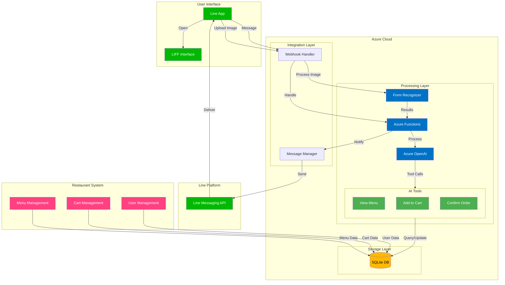
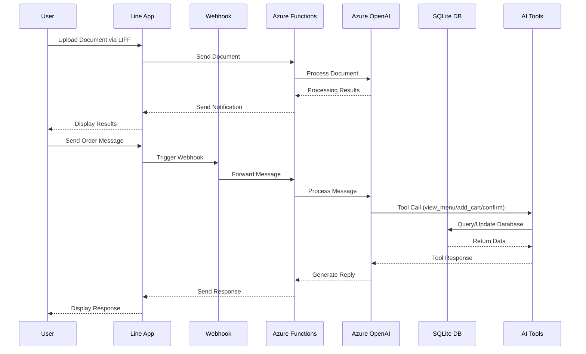
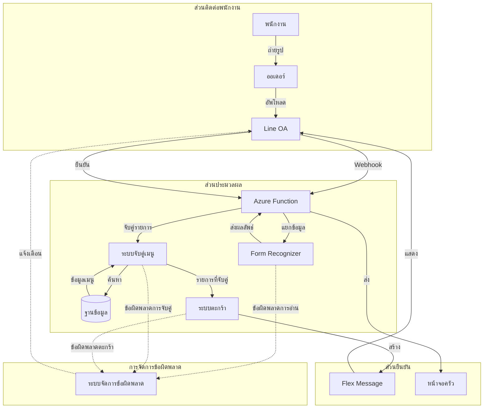
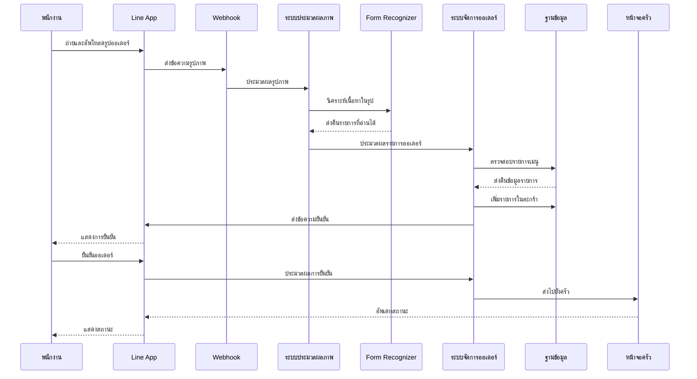

# การประมวลผลเอกสารด้วย Azure Form Recognizer

## การเพิ่มระบบรับออเดอร์ผ่านรูปภาพสำหรับร้านอาหาร

---

## 🔄 ทบทวนระบบปัจจุบัน

### ฟีเจอร์ที่มีอยู่

-   การเชื่อมต่อกับ Line OA
-   การจัดการเมนูผ่าน SQLite
-   การประมวลผลออเดอร์ด้วย OpenAI
-   ระบบตะกร้าสินค้า
-   การอัพเดทสถานะแบบเรียลไทม์

---



---



---

## 🎯 ภาพรวมฟีเจอร์ใหม่

### ขั้นตอนการทำงานสำหรับพนักงาน

1. พนักงานถ่ายรูปออเดอร์ที่เขียนด้วยมือ
2. อัพโหลดผ่าน Line OA
3. Form Recognizer ประมวลผลรูปภาพ
4. ระบบเพิ่มรายการในตะกร้า
5. พนักงานยืนยันออเดอร์
6. ส่งออเดอร์ไปยังครัว

---

## 🛠️ การพัฒนาทางเทคนิค



---

## 🧔‍♂️ แผนภาพลำดับการทำงาน



---

## เริ่มต้นการพัฒนา

### บริการ Azure ที่ต้องใช้

```javascript
// ตั้งค่า Form Recognizer Client
const client = new DocumentAnalysisClient(process.env.FORM_RECOGNIZER_ENDPOINT, process.env.FORM_RECOGNIZER_KEY);
```

### การเชื่อมต่อ Line

```javascript
// ดึงรูปภาพจาก Line
const imageBuffer = await getImageContent(messageId);
```

---

## 📋 ขั้นตอนการประมวลผลหลัก

### 1. การรับรูปภาพ

```javascript
if (event.message?.type === "image") {
    const imageBuffer = await getImageContent(event.message.id);
    // ประมวลผลรูปภาพ...
}
```

### 2. การใช้ Form Recognizer

```javascript
const poller = await client.beginAnalyzeDocument("prebuilt-document", imageBuffer);
const { content, tables } = await poller.pollUntilDone();
```

---

## 🔍 ระบบจับคู่เมนู

### การจับคู่แบบคลุมเครือ

```javascript
// จับคู่รายการที่อ่านได้กับเมนู
const menuItem = await db.get(
    `SELECT id, name FROM tb_menu 
     WHERE name LIKE ?`,
    [`%${item.itemName}%`],
);
```

---

## 🛒 การเชื่อมต่อกับตะกร้า

### การเพิ่มรายการในตะกร้า

```javascript
for (const item of mappedItems) {
    await addToCart(userId, item.menuId, item.quantity);
}
```

### ขั้นตอนการยืนยัน

-   สร้าง Flex Message
-   แสดงสรุปออเดอร์
-   ตัวเลือกยืนยัน/ยกเลิก

---

## 📱 ส่วนติดต่อผู้ใช้

### ตัวอย่าง Flex Message

```javascript
{
    type: "bubble",
    body: {
        type: "box",
        layout: "vertical",
        contents: [
            {
                type: "text",
                text: "รายการที่อ่านได้",
                weight: "bold"
            }
            // ... รายละเอียดรายการ
        ]
    }
}
```

---

## 🔍 การจัดการข้อผิดพลาด

### จุดสำคัญ

1. ข้อผิดพลาดการประมวลผลรูปภาพ
2. การอ่านไม่สำเร็จ
3. ปัญหาการจับคู่เมนู
4. การทำงานกับฐานข้อมูล
5. การสื่อสารกับ Line API

---

## 📊 กลยุทธ์การทดสอบ

### พื้นที่การทดสอบ

1. การทดสอบหน่วยย่อย

    - การประมวลผลรูปภาพ
    - การจับคู่เมนู
    - การทำงานของตะกร้า

2. การทดสอบการทำงานร่วมกัน

    - การทำงานตั้งแต่ต้นจนจบ
    - สถานการณ์ข้อผิดพลาด

3. การทดสอบในสภาพแวดล้อมจริง
    - การฝึกอบรมพนักงาน
    - การประมวลผลออเดอร์จริง

---

## 🚀 ขั้นตอนการ Deploy

1. อัพเดท Environment Variables

```bash
FORM_RECOGNIZER_ENDPOINT=xxx
FORM_RECOGNIZER_KEY=xxx
```

2. Deploy Azure Function

```bash
func azure functionapp publish <ชื่อแอป>
```

3. อัพเดท URL Webhook ของ Line

---

## 📈 การพัฒนาในอนาคต

1. รองรับหลายภาษา
2. การฝึกฝนฟอร์มแบบกำหนดเอง
3. การเชื่อมต่อกับจอแสดงผลในครัว
4. การวิเคราะห์ออเดอร์
5. แอปพลิเคชันมือถือสำหรับพนักงาน

---

## 🙋‍♂️ ถาม-ตอบ
