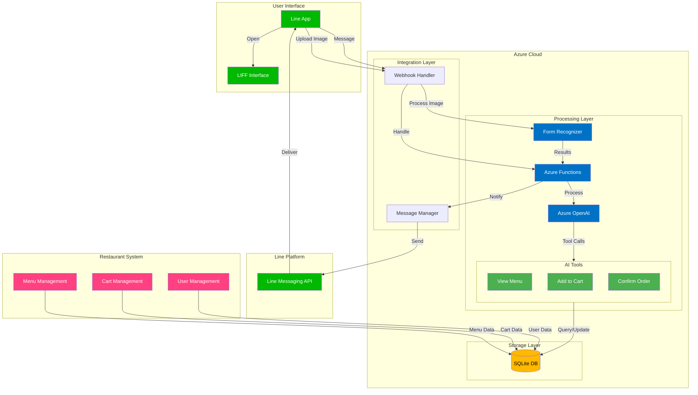
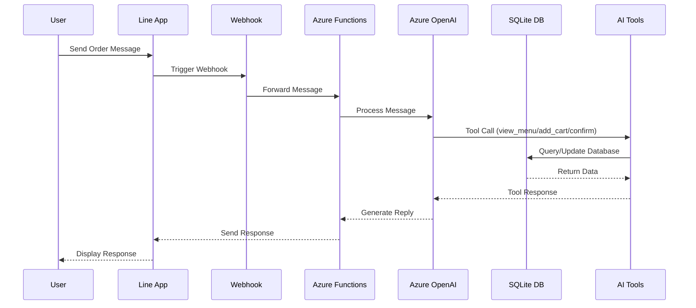
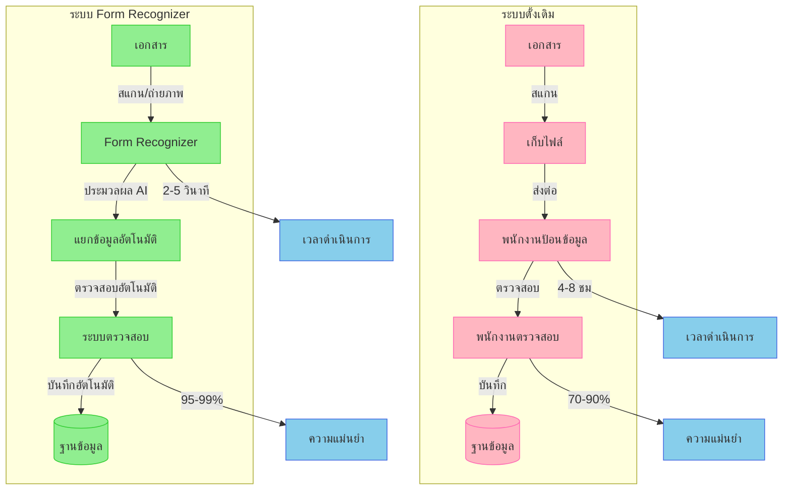
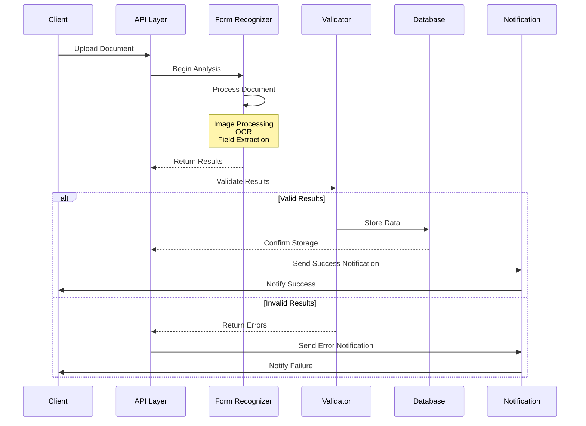
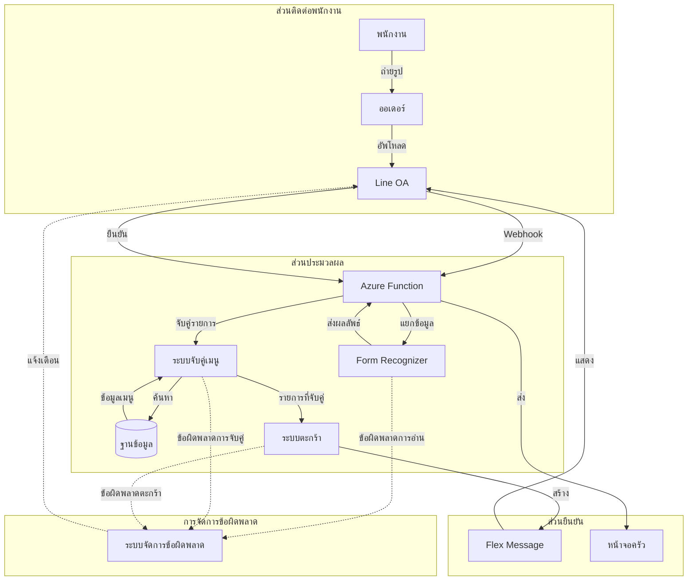
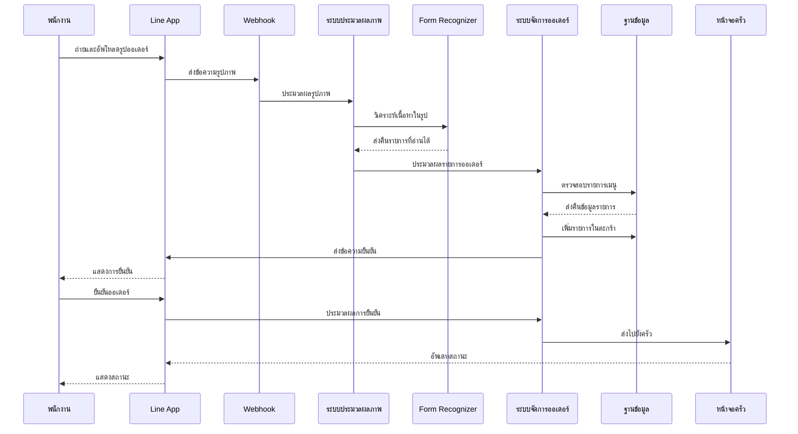

# การประมวลผลเอกสารด้วย Azure Form Recognizer

## การเพิ่มระบบรับออเดอร์ผ่านรูปภาพสำหรับร้านอาหาร

---

## 🔄 ทบทวนระบบปัจจุบัน

### ฟีเจอร์ที่มีอยู่

-   การเชื่อมต่อกับ Line OA
-   การจัดการเมนูผ่าน SQLite
-   การประมวลผลออเดอร์ด้วย OpenAI
-   ระบบตะกร้าสินค้า
-   การอัพเดทสถานะแบบเรียลไทม์

---



---



---

# การประมวลผลเอกสารด้วย Azure Form Regonizer (Integration to LineOA)

## 📑 นิยามพื้นฐาน

Azure Form Recognizer คือบริการ AI (Artificial Intelligence) ที่ใช้เทคโนโลยี Machine Learning ในการวิเคราะห์และดึงข้อมูลจากเอกสาร เป็นส่วนหนึ่งของบริการ Azure Cognitive Services

## 🔍 ความสามารถหลัก

### 1. การอ่านและแยกแยะข้อมูล

-   OCR (Optical Character Recognition)
-   ดึงข้อความจากรูปภาพ
-   แยกแยะโครงสร้างเอกสาร
-   เข้าใจความสัมพันธ์ของข้อมูล

### 2. รูปแบบเอกสารที่รองรับ

-   ใบเสร็จ (Receipts)
-   ใบแจ้งหนี้ (Invoices)
-   นามบัตร (Business Cards)
-   บัตรประจำตัว (ID Documents)
-   แบบฟอร์มต่างๆ (Custom Forms)

### 3. การทำงานแบบอัตโนมัติ

-   ประมวลผล 24/7
-   รองรับปริมาณมาก
-   แม่นยำสูง
-   ทำงานแบบ Real-time

## 🌟 ที่มาของ Azure Form Recognizer

### ปัญหาที่นำมาสู่การพัฒนา

1. **การจัดการเอกสารแบบดั้งเดิม**

    - ใช้แรงงานคนในการป้อนข้อมูล
    - เสียเวลาและทรัพยากรมาก
    - มีโอกาสเกิดข้อผิดพลาดสูง
    - ไม่สามารถรองรับปริมาณงานจำนวนมาก

2. **ความต้องการทางธุรกิจ**
    - ต้องการระบบอัตโนมัติที่มีประสิทธิภาพ
    - ต้องการลดต้นทุนการดำเนินงาน
    - ต้องการเพิ่มความเร็วในการประมวลผล
    - ต้องการความแม่นยำสูง

---



## 💡 ความสำคัญและประโยชน์

### 1. ด้านประสิทธิภาพการทำงาน

-   **ความเร็วในการประมวลผล**

    -   ลดเวลาการทำงานจากชั่วโมงเป็นวินาที
    -   รองรับการประมวลผลพร้อมกันหลายเอกสาร
    -   ทำงานได้ 24/7 ไม่มีการหยุดพัก

-   **ความแม่นยำ**
    -   ใช้ AI และ Machine Learning ในการอ่านข้อมูล
    -   ลดข้อผิดพลาดจากการป้อนข้อมูลด้วยมือ
    -   มีระบบตรวจสอบความถูกต้องอัตโนมัติ

### 2. ด้านธุรกิจ

-   **การลดต้นทุน**

    -   ลดค่าใช้จ่ายด้านบุคลากร
    -   ลดต้นทุนการจัดการเอกสาร
    -   ประหยัดพื้นที่จัดเก็บเอกสาร

-   **การเพิ่มประสิทธิภาพ**
    -   เพิ่มความรวดเร็วในกระบวนการทำงาน
    -   ลดขั้นตอนการทำงานที่ซ้ำซ้อน
    -   เพิ่มความพึงพอใจของลูกค้า

### 3. ด้านเทคโนโลยี

-   **การใช้ AI ขั้นสูง**

    -   OCR (Optical Character Recognition)
    -   Machine Learning
    -   Computer Vision
    -   Natural Language Processing

-   **ความยืดหยุ่นในการใช้งาน**
    -   รองรับหลากหลายรูปแบบเอกสาร
    -   สามารถปรับแต่งตามความต้องการ
    -   เชื่อมต่อกับระบบอื่นๆ ได้ง่าย

## 🎯 กลุ่มเป้าหมายและการประยุกต์ใช้

### 1. ภาคธุรกิจ

-   **สถาบันการเงิน**

    -   ประมวลผลใบสมัคร
    -   ตรวจสอบเอกสารทางการเงิน
    -   วิเคราะห์สัญญา

-   **การประกันภัย**

    -   ประมวลผลการเรียกร้องค่าสินไหม
    -   ตรวจสอบกรมธรรม์
    -   จัดการเอกสารประกอบ

-   **การค้าและบริการ**
    -   จัดการใบเสร็จ/ใบกำกับภาษี
    -   ประมวลผลคำสั่งซื้อ
    -   จัดการเอกสารนำเข้า-ส่งออก

### 2. ภาครัฐ

-   **การบริการประชาชน**
    -   ประมวลผลแบบฟอร์มราชการ
    -   ตรวจสอบเอกสารประจำตัว
    -   จัดการคำร้องต่างๆ

---

## 📚 Technical Section

### 1. Prebuilt Models (โมเดลสำเร็จรูป)

-   **Receipt Model**: สำหรับใบเสร็จ
-   **Invoice Model**: สำหรับใบแจ้งหนี้
-   **ID Document Model**: สำหรับบัตรประจำตัว
-   **Business Card Model**: สำหรับนามบัตร
-   **W2 Form Model**: สำหรับฟอร์มภาษี

### 2. Custom Models (โมเดลที่สร้างเอง)

-   ฝึกฝนจากเอกสารของคุณเอง
-   รองรับรูปแบบเฉพาะธุรกิจ
-   ปรับแต่งตามความต้องการ

## 🔧 การติดตั้งและตั้งค่า

```bash
# ติดตั้ง SDK
npm install @azure/ai-form-recognizer

# ตั้งค่า Environment Variables
FORM_RECOGNIZER_ENDPOINT=https://your-endpoint.cognitiveservices.azure.com/
FORM_RECOGNIZER_KEY=your-key
```

## 💡 ตัวอย่างการใช้งาน

### 1. การวิเคราะห์ใบเสร็จ

```javascript
const { DocumentAnalysisClient } = require("@azure/ai-form-recognizer");

const analyzeReceipt = async (imageBuffer) => {
    const client = new DocumentAnalysisClient(process.env.FORM_RECOGNIZER_ENDPOINT, process.env.FORM_RECOGNIZER_KEY);

    try {
        const poller = await client.beginAnalyzeDocument("prebuilt-receipt", imageBuffer);
        const { documents } = await poller.pollUntilDone();

        // ดึงข้อมูลที่สำคัญ
        const receipt = documents[0];
        return {
            merchantName: receipt.fields.MerchantName?.value,
            total: receipt.fields.Total?.value,
            transactionDate: receipt.fields.TransactionDate?.value,
            items: receipt.fields.Items?.value,
        };
    } catch (error) {
        console.error("เกิดข้อผิดพลาด:", error.message);
        throw error;
    }
};
```

### 2. การวิเคราะห์บัตรประชาชน

```javascript
const analyzeIDCard = async (imageBuffer) => {
    const client = new DocumentAnalysisClient(endpoint, key);

    try {
        const poller = await client.beginAnalyzeDocument("prebuilt-idDocument", imageBuffer);
        const { documents } = await poller.pollUntilDone();

        const idCard = documents[0];
        return {
            fullName: idCard.fields.FirstName?.value,
            lastName: idCard.fields.LastName?.value,
            idNumber: idCard.fields.DocumentNumber?.value,
            dateOfBirth: idCard.fields.DateOfBirth?.value,
            expirationDate: idCard.fields.DateOfExpiration?.value,
        };
    } catch (error) {
        console.error("เกิดข้อผิดพลาด:", error.message);
        throw error;
    }
};
```

### 3. การสร้างโมเดลแบบกำหนดเอง

```javascript
const { DocumentModelAdministrationClient } = require("@azure/ai-form-recognizer");

const trainCustomModel = async (trainingDataUrl) => {
    const client = new DocumentModelAdministrationClient(endpoint, key);

    try {
        console.log("เริ่มการฝึกฝนโมเดล...");
        const poller = await client.beginBuildModel({
            trainingDataUrl: trainingDataUrl,
            description: "โมเดลสำหรับเอกสารบริษัท",
        });

        const model = await poller.pollUntilDone();
        console.log(`สร้างโมเดลสำเร็จ: ${model.modelId}`);
        return model;
    } catch (error) {
        console.error("การฝึกฝนล้มเหลว:", error.message);
        throw error;
    }
};
```

## 📝 เทคนิคการใช้งาน

### 1. การเพิ่มประสิทธิภาพการอ่าน

```javascript
const enhanceReadability = {
    // เพิ่มความแม่นยำในการอ่าน
    preprocessing: async (imageBuffer) => {
        // ปรับความคมชัด
        // ปรับขนาดภาพ
        // ลดสัญญาณรบกวน
        return processedImage;
    },

    // จัดการกับภาพที่หมุน
    handleRotation: async (result) => {
        const { angle } = result.pages[0];
        if (angle !== 0) {
            // ดำเนินการแก้ไขการหมุน
        }
        return correctedResult;
    },
};
```

### 2. การจัดการข้อผิดพลาด

```javascript
const handleFormRecognizerErrors = (error) => {
    switch (error.code) {
        case "InvalidImage":
            return "รูปภาพไม่ถูกต้องหรือเสียหาย";
        case "InvalidDocument":
            return "เอกสารไม่รองรับหรือไม่ถูกต้อง";
        case "UnsupportedFileFormat":
            return "นามสกุลไฟล์ไม่รองรับ";
        default:
            return "เกิดข้อผิดพลาดที่ไม่ทราบสาเหตุ";
    }
};
```

## 🔍 การตรวจสอบความถูกต้อง

### 1. การตรวจสอบผลลัพธ์

```javascript
const validateResults = (result) => {
    const validation = {
        isValid: true,
        errors: [],
    };

    // ตรวจสอบความมั่นใจในการอ่าน
    if (result.confidence < 0.8) {
        validation.isValid = false;
        validation.errors.push("ความมั่นใจในการอ่านต่ำเกินไป");
    }

    // ตรวจสอบข้อมูลที่จำเป็น
    if (!result.fields.required_field?.value) {
        validation.isValid = false;
        validation.errors.push("ไม่พบข้อมูลที่จำเป็น");
    }

    return validation;
};
```

## 📊 การใช้งานจริง

### กรณีศึกษา: ระบบจัดการเอกสาร

1. ระบบรับเอกสารเข้า (Input)
2. ประมวลผลอัตโนมัติ (Process)
3. ตรวจสอบความถูกต้อง (Validate)
4. จัดเก็บข้อมูล (Store)
5. ส่งการแจ้งเตือน (Notify)

## 🚀 การพัฒนาต่อยอด

1. **เพิ่มความแม่นยำ**

    - ฝึกฝนด้วยข้อมูลเพิ่มเติม
    - ปรับปรุงการประมวลผลภาพ
    - เพิ่มการตรวจสอบ

2. **ขยายความสามารถ**

    - รองรับภาษาเพิ่มเติม
    - เพิ่มประเภทเอกสาร
    - เชื่อมต่อกับระบบอื่น

3. **เพิ่มประสิทธิภาพ**
    - ทำงานแบบ Batch
    - ประมวลผลแบบขนาน
    - เพิ่มความเร็ว



---

---

---

## 🎯 ฟีเจอร์ใหม่ที่ต่อยอดจากโปรเจคเดิม

### ขั้นตอนการทำงานสำหรับพนักงาน

1. พนักงานถ่ายรูปออเดอร์ที่เขียนด้วยมือ
2. อัพโหลดผ่าน Line OA
3. Form Recognizer ประมวลผลรูปภาพ
4. ระบบเพิ่มรายการในตะกร้า
5. พนักงานยืนยันออเดอร์
6. ส่งออเดอร์ไปยังครัว

---

## 🛠️ การพัฒนาทางเทคนิค



---

## 🧔‍♂️ แผนภาพลำดับการทำงาน



---

## เริ่มต้นการพัฒนา

### บริการ Azure ที่ต้องใช้

```javascript
// ตั้งค่า Form Recognizer Client
const client = new DocumentAnalysisClient(process.env.FORM_RECOGNIZER_ENDPOINT, process.env.FORM_RECOGNIZER_KEY);
```

### การเชื่อมต่อ Line

```javascript
// ดึงรูปภาพจาก Line
const imageBuffer = await getImageContent(messageId);
```

---

## 📋 ขั้นตอนการประมวลผลหลัก

### 1. การรับรูปภาพ

```javascript
if (event.message?.type === "image") {
    const imageBuffer = await getImageContent(event.message.id);
    // ประมวลผลรูปภาพ...
}
```

### 2. การใช้ Form Recognizer

```javascript
const poller = await client.beginAnalyzeDocument("prebuilt-document", imageBuffer);
const { content, tables } = await poller.pollUntilDone();
```

---

## 🔍 ระบบจับคู่เมนู

### การจับคู่แบบคลุมเครือ

```javascript
// จับคู่รายการที่อ่านได้กับเมนู
const menuItem = await db.get(
    `SELECT id, name FROM tb_menu 
     WHERE name LIKE ?`,
    [`%${item.itemName}%`],
);
```

---

## 🛒 การเชื่อมต่อกับตะกร้า

### การเพิ่มรายการในตะกร้า

```javascript
for (const item of mappedItems) {
    await addToCart(userId, item.menuId, item.quantity);
}
```

### ขั้นตอนการยืนยัน

-   สร้าง Flex Message
-   แสดงสรุปออเดอร์
-   ตัวเลือกยืนยัน/ยกเลิก

---

## 📱 ส่วนติดต่อผู้ใช้

### ตัวอย่าง Flex Message

```javascript
{
    type: "bubble",
    body: {
        type: "box",
        layout: "vertical",
        contents: [
            {
                type: "text",
                text: "รายการที่อ่านได้",
                weight: "bold"
            }
            // ... รายละเอียดรายการ
        ]
    }
}
```

---

## 🔍 การจัดการข้อผิดพลาด

### จุดสำคัญ

1. ข้อผิดพลาดการประมวลผลรูปภาพ
2. การอ่านไม่สำเร็จ
3. ปัญหาการจับคู่เมนู
4. การทำงานกับฐานข้อมูล
5. การสื่อสารกับ Line API

---

## 📊 กลยุทธ์การทดสอบ

### พื้นที่การทดสอบ

1. การทดสอบหน่วยย่อย

    - การประมวลผลรูปภาพ
    - การจับคู่เมนู
    - การทำงานของตะกร้า

2. การทดสอบการทำงานร่วมกัน

    - การทำงานตั้งแต่ต้นจนจบ
    - สถานการณ์ข้อผิดพลาด

3. การทดสอบในสภาพแวดล้อมจริง
    - การฝึกอบรมพนักงาน
    - การประมวลผลออเดอร์จริง

---

## 🚀 ขั้นตอนการ Deploy

1. อัพเดท Environment Variables

```bash
FORM_RECOGNIZER_ENDPOINT=xxx
FORM_RECOGNIZER_KEY=xxx
```

2. Deploy Azure Function

```bash
func azure functionapp publish <ชื่อแอป>
```

3. อัพเดท URL Webhook ของ Line

---

## 📈 การพัฒนาในอนาคต

1. รองรับหลายภาษา
2. การฝึกฝนฟอร์มแบบกำหนดเอง
3. การเชื่อมต่อกับจอแสดงผลในครัว
4. การวิเคราะห์ออเดอร์
5. แอปพลิเคชันมือถือสำหรับพนักงาน

---

## 🙋‍♂️ ถาม-ตอบ
