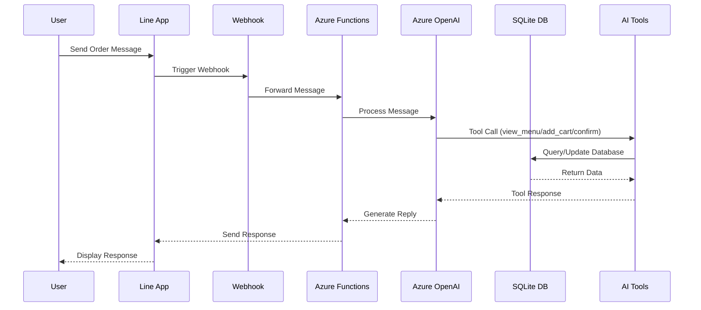
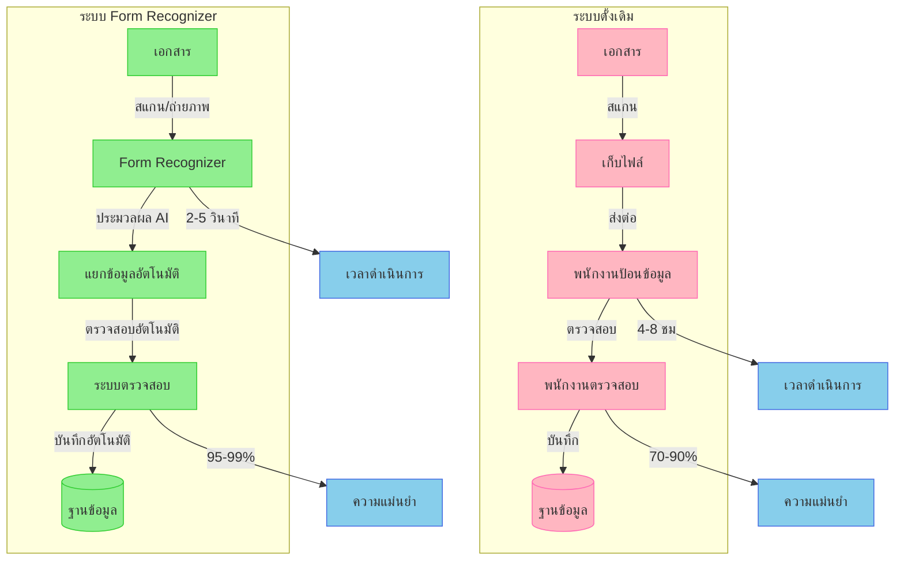
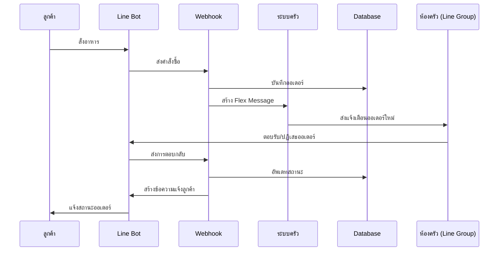

# การประมวลผลเอกสารด้วย Azure Form Recognizer

## การเพิ่มระบบรับออเดอร์ผ่านรูปภาพสำหรับร้านอาหาร

---

## 🔄 ทบทวนระบบปัจจุบัน

### ฟีเจอร์ที่มีอยู่

-   การเชื่อมต่อกับ Line OA
-   การจัดการเมนูผ่าน SQLite
-   การประมวลผลออเดอร์ด้วย OpenAI
-   ระบบตะกร้าสินค้า
-   การอัพเดทสถานะแบบเรียลไทม์

---



---

# การประมวลผลเอกสารด้วย Azure Form Regonizer (Integration to LineOA)

## 📑 นิยามพื้นฐาน

Azure Form Recognizer คือบริการ AI (Artificial Intelligence) ที่ใช้เทคโนโลยี Machine Learning ในการวิเคราะห์และดึงข้อมูลจากเอกสาร เป็นส่วนหนึ่งของบริการ Azure Cognitive Services

## 🔍 ความสามารถหลัก

### 1. การอ่านและแยกแยะข้อมูล

-   OCR (Optical Character Recognition)
-   ดึงข้อความจากรูปภาพ
-   แยกแยะโครงสร้างเอกสาร
-   เข้าใจความสัมพันธ์ของข้อมูล

### 2. รูปแบบเอกสารที่รองรับ

-   ใบเสร็จ (Receipts)
-   ใบแจ้งหนี้ (Invoices)
-   นามบัตร (Business Cards)
-   บัตรประจำตัว (ID Documents)
-   แบบฟอร์มต่างๆ (Custom Forms)

### 3. การทำงานแบบอัตโนมัติ

-   ประมวลผล 24/7
-   รองรับปริมาณมาก
-   แม่นยำสูง
-   ทำงานแบบ Real-time

## 🌟 ที่มาของ Azure Form Recognizer

### ปัญหาที่นำมาสู่การพัฒนา

1. **การจัดการเอกสารแบบดั้งเดิม**

    - ใช้แรงงานคนในการป้อนข้อมูล
    - เสียเวลาและทรัพยากรมาก
    - มีโอกาสเกิดข้อผิดพลาดสูง
    - ไม่สามารถรองรับปริมาณงานจำนวนมาก

2. **ความต้องการทางธุรกิจ**
    - ต้องการระบบอัตโนมัติที่มีประสิทธิภาพ
    - ต้องการลดต้นทุนการดำเนินงาน
    - ต้องการเพิ่มความเร็วในการประมวลผล
    - ต้องการความแม่นยำสูง

---



## 💡 ความสำคัญและประโยชน์

### 1. ด้านประสิทธิภาพการทำงาน

-   **ความเร็วในการประมวลผล**

    -   ลดเวลาการทำงานจากชั่วโมงเป็นวินาที
    -   รองรับการประมวลผลพร้อมกันหลายเอกสาร
    -   ทำงานได้ 24/7 ไม่มีการหยุดพัก

-   **ความแม่นยำ**
    -   ใช้ AI และ Machine Learning ในการอ่านข้อมูล
    -   ลดข้อผิดพลาดจากการป้อนข้อมูลด้วยมือ
    -   มีระบบตรวจสอบความถูกต้องอัตโนมัติ

### 2. ด้านธุรกิจ

-   **การลดต้นทุน**

    -   ลดค่าใช้จ่ายด้านบุคลากร
    -   ลดต้นทุนการจัดการเอกสาร
    -   ประหยัดพื้นที่จัดเก็บเอกสาร

-   **การเพิ่มประสิทธิภาพ**
    -   เพิ่มความรวดเร็วในกระบวนการทำงาน
    -   ลดขั้นตอนการทำงานที่ซ้ำซ้อน
    -   เพิ่มความพึงพอใจของลูกค้า

### 3. ด้านเทคโนโลยี

-   **การใช้ AI ขั้นสูง**

    -   OCR (Optical Character Recognition)
    -   Machine Learning
    -   Computer Vision
    -   Natural Language Processing

-   **ความยืดหยุ่นในการใช้งาน**
    -   รองรับหลากหลายรูปแบบเอกสาร
    -   สามารถปรับแต่งตามความต้องการ
    -   เชื่อมต่อกับระบบอื่นๆ ได้ง่าย

## 🎯 กลุ่มเป้าหมายและการประยุกต์ใช้

### 1. ภาคธุรกิจ

-   **สถาบันการเงิน**

    -   ประมวลผลใบสมัคร
    -   ตรวจสอบเอกสารทางการเงิน
    -   วิเคราะห์สัญญา

-   **การประกันภัย**

    -   ประมวลผลการเรียกร้องค่าสินไหม
    -   ตรวจสอบกรมธรรม์
    -   จัดการเอกสารประกอบ

-   **การค้าและบริการ**
    -   จัดการใบเสร็จ/ใบกำกับภาษี
    -   ประมวลผลคำสั่งซื้อ
    -   จัดการเอกสารนำเข้า-ส่งออก

### 2. ภาครัฐ

-   **การบริการประชาชน**
    -   ประมวลผลแบบฟอร์มราชการ
    -   ตรวจสอบเอกสารประจำตัว
    -   จัดการคำร้องต่างๆ

---

## 📚 Technical Section

### 1. Prebuilt Models (โมเดลสำเร็จรูป)

-   **prebuilt-read**: อ่าน Text อย่างเดียว
-   **prebuilt-layout**: อ่าน Text + Table
-   **prebuilt-document**: อ่านเอกสารทั่วไป (เน้น English Docs จะแม่นยำมากๆ)

### 2. Custom Models (โมเดลที่สร้างเอง มีค่า Custom Train)

-   ฝึกฝนจากเอกสารของคุณเอง
-   รองรับรูปแบบเฉพาะธุรกิจ
-   ปรับแต่งตามความต้องการ

## 🔧 การติดตั้งและตั้งค่า

```bash
# ติดตั้ง SDK
npm install @azure/ai-form-recognizer

# ตั้งค่า Environment Variables
FORM_RECOGNIZER_ENDPOINT=https://your-endpoint.cognitiveservices.azure.com/
FORM_RECOGNIZER_KEY=your-key
```

## 💡 ตัวอย่างการใช้งาน

### 1. Use Read model

```javascript
from azure.core.credentials import AzureKeyCredential
from azure.ai.formrecognizer import DocumentAnalysisClient

endpoint = "YOUR_FORM_RECOGNIZER_ENDPOINT"
key = "YOUR_FORM_RECOGNIZER_KEY"

def format_bounding_box(bounding_box):
    if not bounding_box:
        return "N/A"
    return ", ".join(["[{}, {}]".format(p.x, p.y) for p in bounding_box])

def analyze_read():
    # sample document
    formUrl = "https://raw.githubusercontent.com/Azure-Samples/cognitive-services-REST-api-samples/master/curl/form-recognizer/sample-layout.pdf"

    document_analysis_client = DocumentAnalysisClient(
        endpoint=endpoint, credential=AzureKeyCredential(key)
    )

    poller = document_analysis_client.begin_analyze_document_from_url(
            "prebuilt-read", formUrl)
    result = poller.result()

    print ("Document contains content: ", result.content)

    for idx, style in enumerate(result.styles):
        print(
            "Document contains {} content".format(
                "handwritten" if style.is_handwritten else "no handwritten"
            )
        )

    for page in result.pages:
        print("----Analyzing Read from page #{}----".format(page.page_number))
        print(
            "Page has width: {} and height: {}, measured with unit: {}".format(
                page.width, page.height, page.unit
            )
        )

        for line_idx, line in enumerate(page.lines):
            print(
                "...Line # {} has text content '{}' within bounding box '{}'".format(
                    line_idx,
                    line.content,
                    format_bounding_box(line.polygon),
                )
            )

        for word in page.words:
            print(
                "...Word '{}' has a confidence of {}".format(
                    word.content, word.confidence
                )
            )

    print("----------------------------------------")


if __name__ == "__main__":
    analyze_read()

```

### 2. Use layout model

```javascript

from azure.core.credentials import AzureKeyCredential
from azure.ai.formrecognizer import DocumentAnalysisClient

endpoint = "YOUR_FORM_RECOGNIZER_ENDPOINT"
key = "YOUR_FORM_RECOGNIZER_KEY"

# sample document
formUrl = "https://raw.githubusercontent.com/Azure-Samples/cognitive-services-REST-api-samples/master/curl/form-recognizer/sample-layout.pdf"

document_analysis_client = DocumentAnalysisClient(
    endpoint=endpoint, credential=AzureKeyCredential(key)
)

poller = document_analysis_client.begin_analyze_document_from_url("prebuilt-layout", formUrl)
result = poller.result()

for idx, style in enumerate(result.styles):
    print(
        "Document contains {} content".format(
         "handwritten" if style.is_handwritten else "no handwritten"
        )
    )

for page in result.pages:
    for line_idx, line in enumerate(page.lines):
        print(
         "...Line # {} has text content '{}'".format(
        line_idx,
        line.content.encode("utf-8")
        )
    )

    for selection_mark in page.selection_marks:
        print(
         "...Selection mark is '{}' and has a confidence of {}".format(
         selection_mark.state,
         selection_mark.confidence
         )
    )

for table_idx, table in enumerate(result.tables):
    print(
        "Table # {} has {} rows and {} columns".format(
        table_idx, table.row_count, table.column_count
        )
    )

    for cell in table.cells:
        print(
            "...Cell[{}][{}] has content '{}'".format(
            cell.row_index,
            cell.column_index,
            cell.content.encode("utf-8"),
            )
        )

print("----------------------------------------")

```

## 🚀 การพัฒนาต่อยอด

1. **เพิ่มความแม่นยำ**

    - ฝึกฝนด้วยข้อมูลเพิ่มเติม
    - ปรับปรุงการประมวลผลภาพ
    - เพิ่มการตรวจสอบ

2. **ขยายความสามารถ**

    - รองรับภาษาเพิ่มเติม
    - เพิ่มประเภทเอกสาร
    - เชื่อมต่อกับระบบอื่น

3. **เพิ่มประสิทธิภาพ**
    - ทำงานแบบ Batch
    - ประมวลผลแบบขนาน
    - เพิ่มความเร็ว

---

## 🎯 ฟีเจอร์ใหม่ที่ต่อยอดจากโปรเจคเดิม

### ขั้นตอนการทำงานสำหรับพนักงาน

1. พนักงานถ่ายรูปออเดอร์ที่เขียนด้วยมือ
2. อัพโหลดผ่าน Line OA
3. Form Recognizer ประมวลผลรูปภาพ
4. ระบบเพิ่มรายการในตะกร้า
5. พนักงานยืนยันออเดอร์
6. ส่งออเดอร์ไปยังครัว

---

## 🛠️ การพัฒนาทางเทคนิค

### 🧔‍♂️ แผนภาพลำดับการทำงาน


